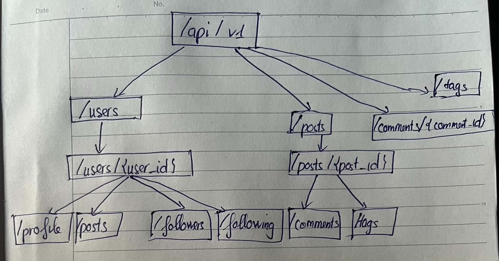
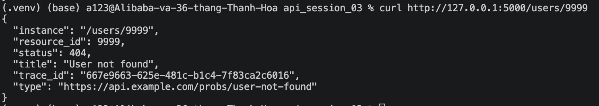
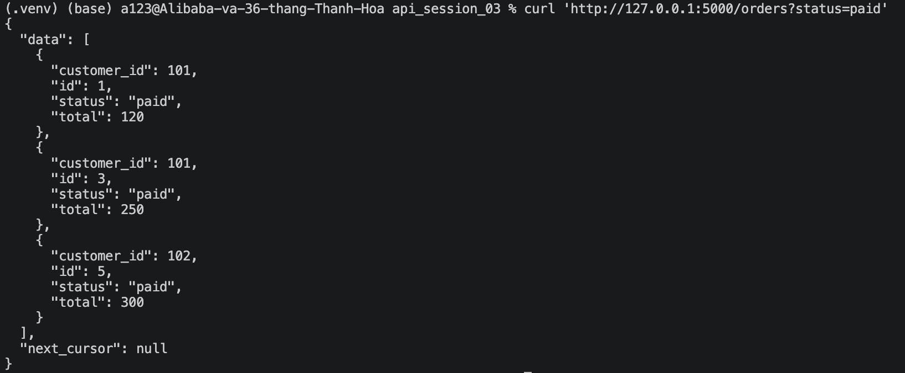
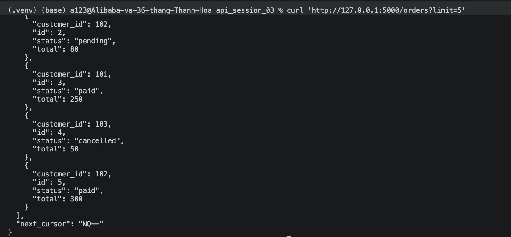
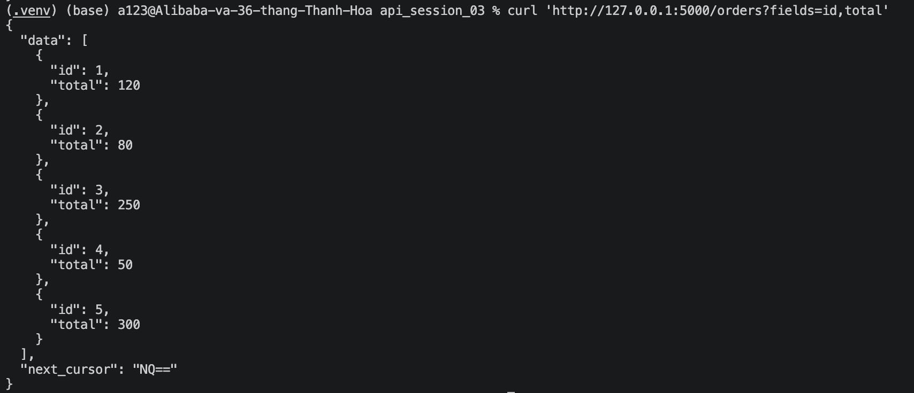
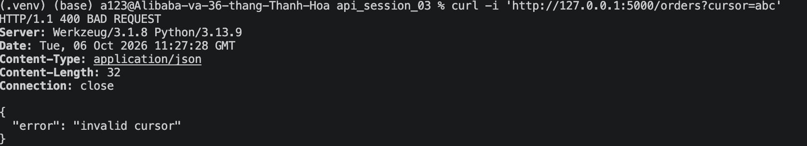

## Lab 1:
### 1. Xác định resources trong miền
Các resource chính:
- users: người dùng
- posts: bài viết
- comments: bình luận
- tags: thẻ
- profile: hồ sơ người dùng
- followers / following: quan hệ theo dõi

### 2. Phân loại endpoint

### Collection
GET  /api/v1/users
POST /api/v1/users

GET  /api/v1/posts
POST /api/v1/posts

GET  /api/v1/tags
POST /api/v1/tags

### Item
GET    /api/v1/users/{user_id}
PATCH  /api/v1/users/{user_id}
DELETE /api/v1/users/{user_id}

GET    /api/v1/posts/{post_id}
PATCH  /api/v1/posts/{post_id}
DELETE /api/v1/posts/{post_id}

### Sub-resource

GET  /api/v1/users/{user_id}/posts
GET  /api/v1/users/{user_id}/profile

GET  /api/v1/posts/{post_id}/comments
POST /api/v1/posts/{post_id}/comments

GET  /api/v1/posts/{post_id}/tags

GET /api/v1/users/{user_id}/followers
GET /api/v1/users/{user_id}/following

### 3. Sơ đồ cây endpoint

## Lab 2:
### RESPONSE 404 Not Found

## Lab 3:

